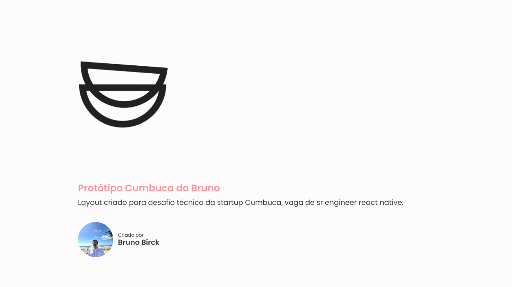
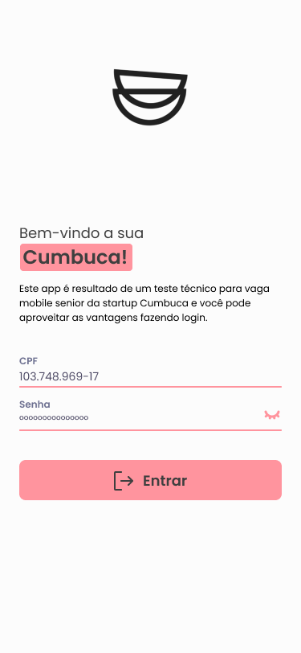
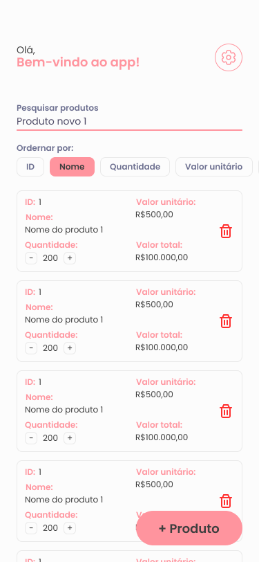
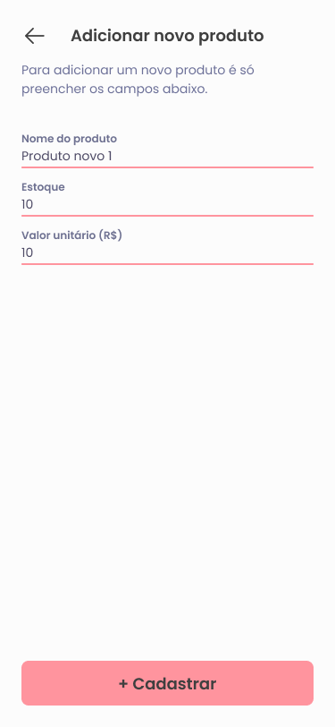

<h1 align="center">
    
</h1>

<h4 align="center"> 
	Cumbuca do Bruno 🚀
</h4>

<p align="center">
 <a href="#-sobre-o-projeto">Sobre</a> •
 <a href="#-funcionalidades">Funcionalidades</a> •
 <a href="#-layout">Layout</a> • 
 <a href="#-como-executar-o-projeto">Como executar</a> • 
 <a href="#-tecnologias">Tecnologias</a> • 
 <a href="#-contribuidores">Arquitetura</a> • 
 <a href="#-autor">Autor</a> • 
</p>

## 💻 Sobre o projeto

Cumbuca do Bruno - este app é resultado de um desafio técnico proposto pela startup [Cumbuca](https://www.cumbuca.com/) para o cargo de Sr. React Native Engineer. A aplicação em si tem como propósito permitir ao usuário criar uma conta e cadastrar produtos, tudo persistido de forma local.

---

## ⚙️ Funcionalidades

- [x] O usuário pode criar uma conta com CPF e senha válidos e reutilizar para login futuramente
- [x] O app possui light e dark theme
- [x] O app permite login com biometria
- [x] O app permite a listagem, filtros e ordenação personalizada para os produtos cadastrados
- [x] O app permite o cadastro de novos produtos
- [x] O app possui persistência de dados no dispositivo

---

## 🎨 Layout

O layout da aplicação está disponível no Figma:

<a href="https://www.figma.com/file/FHwZMOEoMyStOzkHqgJwox/Technical-Test---Cumbuca?type=design&mode=design&t=pQazchhpQSBgTMg6-1">
  
</a>

### Screenshots

<p align="center">
  

  

  
</p>

---

## 🚀 Como executar o projeto

Para executar o projeto você pode fazer o clone do projeto e rodar localmente ou se quiser, recomendo fortemente solicitar o acesso ao app para devices físicos, pois o mesmo foi gerado apk para android e versão de teste no apple testflight. Caso queira o apk para android basta [acessar o link](https://drive.google.com/file/d/1d_xuR8YDmCQt5L8tMmJJCH2SD7X9ZTNh/view?usp=sharing) e baixar, já para o iOS pode solicitar enviando um e-mail para bfbirck@gmail.com com nome, e-mail do icloud para teste e número de telefone.

### Pré-requisitos

Antes de começar, você vai precisar ter instalado em sua máquina as seguintes ferramentas:
[Git](https://git-scm.com), [Node.js](https://nodejs.org/en/).
Além disto é bom ter um editor para trabalhar com o código como [VSCode](https://code.visualstudio.com/)

#### 🧭 Rodando a aplicação

```bash

# Clone este repositório
$ git clone git@github.com:BrunoBirck/cumbuca.git

# Acesse a pasta do projeto no seu terminal/cmd
$ cd cumbuca

# Instale as dependências
$ yarn

# Instale os pods
$ cd ios && pod install && cd ..

# Inicie o metro
$ yarn start

# Execute no sistema iOS
$ yarn ios

# Execute no sistema android
$ yarn android

```

#### 🧭 Rodando testes

```bash

# Para testes unitários
$ yarn test

# Para testes E2E ios
$ yarn detox:build:ios && yarn detox:test:ios

# Para testes E2E android
$ yarn detox:build:android && yarn detox:test:android

```

---

## 🛠 Tecnologias

As seguintes ferramentas foram usadas na construção do projeto:

#### **Mobile** ([React Native](http://www.reactnative.com/) + [TypeScript](https://www.typescriptlang.org/))

- **[React Navigation](https://reactnavigation.org/)**
- **[React Hook Form](https://react-hook-form.com/)**
- **[React Native Biometrics](https://www.npmjs.com/package/react-native-biometrics)**
- **[React Native Bootsplash](https://github.com/zoontek/react-native-bootsplash)**
- **[React Native MMKV](https://github.com/mrousavy/react-native-mmkv)**
- **[Styled Components](https://styled-components.com/)**
- **[Yup](https://github.com/jquense/yup)**

> Veja o arquivo [package.json](https://github.com/BrunoBirck/cumbuca/blob/main/package.json)

#### **Utilitários**

- Protótipo: **[Figma](https://www.figma.com/)** → **[Protótipo (Cumbuca)](https://www.figma.com/file/1SxgOMojOB2zYT0Mdk28lB/Ecoleta)**
- Editor: **[Visual Studio Code](https://code.visualstudio.com/)**
- Markdown: **[StackEdit](https://stackedit.io/)**, **[Markdown Emoji](https://gist.github.com/rxaviers/7360908)**
- Commit Conventional: **[Commitlint](https://github.com/conventional-changelog/commitlint)**
- Fontes: **[Poppins](https://fonts.google.com/specimen/Poppins)**

---

## 🦸 Autor

<a href="#">
 <a href='https://postimg.cc/gn3tVJcX' target='_blank'></a>
 <br />
 <sub><b>Bruno Birck</b></sub></a>
 <br />

[](https://www.linkedin.com/in/bruno-birck-4599791b5/)
[](mailto:bfbirck@gmail.com)
